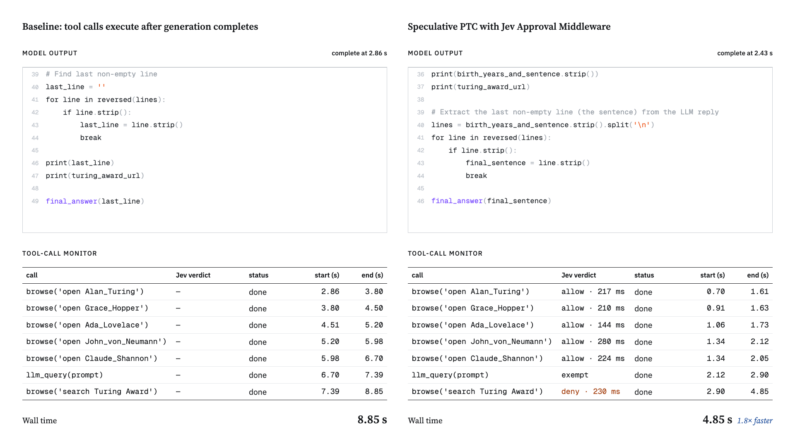

# spec-ptc-jev

Speculative tool calling for code-writing agents, with a per-call approval step.

Agents that act by writing code normally run nothing until the model has finished
writing. [spec-ptc](https://github.com/alexzhang13/spec-ptc) starts tool calls while the
code is still streaming, for tools you flag as safe in advance. Here each call is
checked instead: [Jev](https://docs.typesafe.ai), a 0.2 s yes/no classifier, reads the
call and its arguments against an approval policy you write as a prompt. Approved calls
start right away. Denied calls run at their normal place once the code is complete.

```python
from spec_ptc_jev import SpecRepl

repl = SpecRepl(model="gpt-4.1-mini")

# Jev checks every browse() call against this before it may start early.
APPROVAL_POLICY = (
    "Opening a URL and reading the page text. "
    "Never searching, typing, clicking, submitting a form, or logging in."
)

@repl.tool(early_when=APPROVAL_POLICY)
def browse(command: str) -> str:
    return chromium.browse(command)

@repl.tool(early=True)  # always safe, skips Jev
def llm_query(prompt: str) -> str:
    return sub_model(prompt)

result = repl.completion(TASK)
print(result.response)
```



## Install

```bash
uv add git+https://github.com/pav-bio-gh/spec-ptc-jev
export TYPESAFE_API_KEY=...   # only needed when a tool has early_when
export OPENAI_API_KEY=...     # for SpecRepl(model=...)
```

## Usage

- `repl.completion(task)` runs the task to a final answer. In an asyncio app use
  `await repl.acompletion(task)`. Tools can be plain functions or `async def`.
- `early_when="..."` is the approval policy for a tool. `early=True` marks a tool as
  always safe. A tool with neither never starts early.
- With no tool marked, it is a plain generate-then-run loop and Jev is never contacted.
- Other model providers: pass `client=` for any OpenAI-compatible server, or write a
  `chat(messages)` function that streams text and call `repl.run(chat, task)`.
- Own your loop: `repl.run_turn(stream)` runs one turn from a token stream.
- Any approver works: `SpecRepl(judge=...)` takes any object with a `decide` method.

## Results

One agent turn: load five web pages in a real headless browser, query a sub-model,
submit one search form. Five live runs per setup, all 20 correct.

| Setup | Median wall time |
| --- | --- |
| Baseline: tool calls execute after generation completes | 8.85 s |
| Stock spec-ptc, browse tool defaults to no speculation | 8.77 s |
| Parallel calls, none before generation completes | 6.54 s |
| Speculative PTC with Jev approval | 4.85 s |

On 103 state-changing `bash`, `sql`, `http` and prompt-injection calls, Jev approved
none early, and it approved 74 of 78 safe ones. Those sets are small and have one author.

Reproduce: `uv run python -m examples.browse_race 5` and
`uv run python -m evals.run_gate_eval`. The write-up is at
[pav.bio/blog/speculative-tool-calling-with-jev](https://pav.bio/blog/speculative-tool-calling-with-jev).

## How it works

- The code runs once, in order. A call that was approved early just picks up its result.
- A call starts early only after a yes. A timeout or an error counts as a no.
- A denied call never runs before the code is complete, and never runs if the code does
  not parse.
- Planning ahead never runs model-written code. It only reads arguments that are already
  plain values.

## Limits

- The approver only sees tool calls. If the program writes a file in plain Python and a
  tool reads it, an early read can land first. Do not give that tool a policy.
- An early call can be wasted if the program never uses its result.
- Keep dangerous tools behind the sandbox you would use anyway. The approver decides
  when a call runs, not whether it is allowed.

## Develop

```bash
uv sync
uv run playwright install chromium-headless-shell   # for the examples
uv run pytest                                       # offline
```

## Credit

Speculative programmatic tool calling and `spec-ptc` are Alex Zhang's work
([blog](https://alexzhang13.github.io/blog/2026/spec-ptc/),
[repo](https://github.com/alexzhang13/spec-ptc)). MIT licensed.
